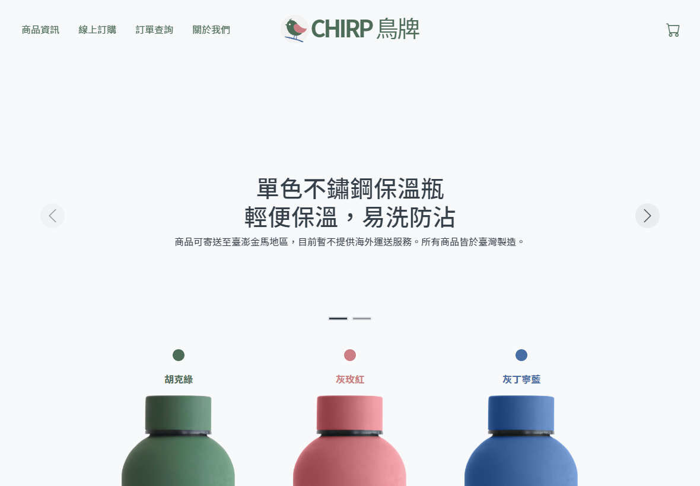
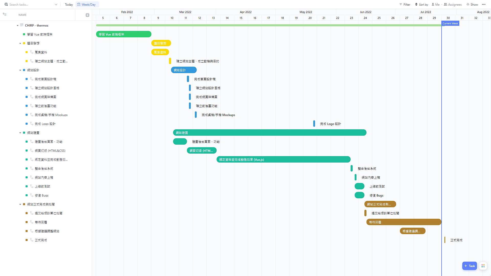

# [CHIRP鳥牌 - 單色不鏽鋼保溫瓶](https://samchiu064.github.io/CHIRP-thermos/#/)
此專案為虛擬保溫瓶品牌「CHIRP鳥牌」的電商網站。本作品為開發者對前端領域所學所知的展現，主要使用 Vue 前端框架製作，

  

## 目錄
- [網站介紹](#網站介紹)
- [網站設計](#設計)
  - [字體選用](#字體選用)
  - [色彩計畫](#色彩計畫)
  - [Logo 設計](#Logo-設計)
  - [網站架構](#網站架構)
- [Mockups](#Mockups)
  - [桌電/筆電](#桌電/筆電)
  - [行動裝置](#行動裝置)
- [使用技術/工具](#使用技術/工具)
  - [設計相關](#設計相關)
  - [前端開發相關](#前端開發香菇ㄢ)
- [專案回顧](#專案回顧)
  - [開發時程](#開發時程)
  - [專案架構](#專案架構)
  - [問題與思考](#問題與思考)
- [關於作者](#關於作者)
- [License](#License)

---

## 網站介紹

  - 網站名稱：CHIRP鳥牌 - 單色不鏽鋼保溫瓶
  - 網站主題：販售保溫瓶的電子商務網站
  - 架站目的：有感於市售的保溫瓶並不適合裝填飲用水以外的飲品，以及存在零件汰換率的問題，我們希望能夠以現有產品為立基點，設計一款符合臺灣民眾使用習慣的保溫瓶。
  - 目標客群：在尋找以好的材質製作、保溫程度高且清潔方法簡易的保溫瓶
  - 網站特色：商品項目單一、不需登入註冊即可下單、購物流程短

---
## 網站設計

### 字體選用

[Noto Sans TC](https://fonts.google.com/noto/specimen/Noto+Sans+TC)

### 色彩計畫

- White - CTA buttons 文字/小圖標顏色, 購物車背景色
- Cultured Gray - 網頁背景顏色
- Sonic Silver Gray - 圖片/產品說明, 頁尾社群圖標顏色, 次要連結顏色
- Arsenic Black - 網頁文案顏色, 導覽列連結顏色
- Hooker's Green - Logo 主色, 產品顏色
- Old Rose - Logo 輔色, 產品顏色
- Blue Yonder - Logo 輔色, 產品顏色

### Logo 設計

以鳥在圓形的空間中立於枝幹上為形象，象徵著自己雖出身平凡，但只要具備堅毅的身心，揮舞著熱情腳踏實地根據自己的理想而活，在別人眼中也能夠大放異彩。

### 網站架構

<pre>
  前臺網站架構
  |- 前臺首頁
    |- 商品資訊
    |- 線上訂購
    |- 訂單查詢
    |- 關於我們
  |- 購物車
    |- 訂單查詢
      |- 訂單確認
        |- 訂單成立 ---> 訂單查詢

  後臺網站架構
  |- 後臺首頁
    |- 登入頁面
    |- 產品管理
    |- 訂單管理
    |- 優惠券管理
</pre>

---

## Mockups

繪製 Mockups 時以儘快完成 1. 產品相關頁面 2. 購物流程相關頁面 為目標，共繪製出 7 個頁面。相較於設計稿配色的不一致，成品將網站風格統一為以灰色為主，並新增了訂單查詢、訂單成立兩個頁面。

### 桌電/筆電

### 行動裝置

---

## 使用技術/工具

### 設計相關

  - [Affinity Photo](https://affinity.serif.com/en-gb/photo/) - 產品圖後製、繪製桌電版 Mockups
  - [Affinity Designer](https://affinity.serif.com/en-gb/) - 繪製 Logo
  - [Lunacy](https://icons8.com/lunacy) - 繪製行動裝置版 Mockups
  
### 前端開發相關

  - [HTML5](https://www.w3schools.com/html/)
  - [CSS3](https://www.w3schools.com/css/)
  - [JavaScript](https://www.w3schools.com/js/DEFAULT.asp)
  - [SCSS](https://sass-lang.com/)
  - [Bootstrap 5](https://getbootstrap.com/)
  - [Bootstrap Icons](https://icons.getbootstrap.com/)
  - [axios](https://github.com/axios/axios)
  - [Vue 3](https://vuejs.org/)
  - [Vue CLI](https://cli.vuejs.org/)
  - [Vue Router](https://router.vuejs.org/)
  - [VeeValidate](https://vee-validate.logaretm.com/v4/)
  - [Vue-axios](https://www.npmjs.com/package/vue-axios)
  - [Vue-loading-overlay](https://www.npmjs.com/package/vue-loading-overlay)
  - [Vue3-progressbar](https://github.com/aacassandra/vue3-progressbar)
  - [Pinia](https://pinia.vuejs.org/)
  - [npm](https://www.npmjs.com/)
  - [Github](https://github.com/)
  - [ESLint (Airbnb)](https://eslint.org/)

---

## 專案回顧

### 開發時程

</img>

### 專案架構

<pre>
src/
|- api (放置專案中使用到的所有API)
|- assets (放置所有靜態圖片、CSS helpers)
|- component (放置所有組件)
|- methods (放置專案中的共用方法)
|- mixins (放置專案中的共用 mixins)
|- router (放置 Vue router 設定檔)
|- stores (放置 Pinia stores)
|- views (放置所有頁面元件)
</pre>

### 問題與思考

  - Eslint 和 Prettier 有衝突導致編譯失敗，該關閉 Linter 的 rules 還是調整 Prettier?\
  &rarr; 引入 [pre-made configs](https://github.com/prettier/eslint-config-prettier) 將 Linter 中 code formatting 的 rules 關閉。
    > Linter 對程式碼的品管可分為 code formatting 及 code quality 兩個部份，根據 [Prettier 官方的解釋](https://prettier.io/docs/en/integrating-with-linters.html)，Prettier 並不會調整任何和 code quality 有關的規則，而是取代 Linter code formatting 的工作，維持程式碼的一致。

  - API 資料接回來後，如果沒有需要的資料該怎麼辦?\
  &rarr; 在 computed 裡對從 API 存回來的資料做加工，可以參考專案中 [productStore](src/stores/productStore.js) 這個檔案在 getters 的寫法，示範如何將陣列中的每個物件依照現有屬性新增資料。

  - State management library (ex: Pinia) 可以完全取代 props/emit 嗎?\
  &rarr; 不行，這樣會導致元件無法被複用。
    >兩者最大的差異在於 Pinia store 是 SSOT (Single source of truth)，而 props 的來源可以是不同的。在元件要複用的情況下，使用 store 會導致元件的 layout 被綁死，沒辦法透過接收 props 改變 render 的內容。\
    >例如一張卡片元件使用 store 接收資料，在引入 product 的資料後，理所當然會 render 的內容為 product.title,  product.image...，但此時如果要再新增一張風景資料的卡片呢? 由於 render 的內容已經固定為 product.title...，就勢必得再建立一個 layout 幾乎一模一，只改變 render 內容的卡片，而這已經違反了 DRY 的開發原則。
  
  - 當 CSS library (ex: Bootstrap) 和自訂義 CSS 都能達成相同的效果時，應該選擇哪個?\
  &rarr; CSS library 優先，若有調整需求則以 extend/overrides 的方式來思考: 先加上 css library 的 class 再將自訂的 css style 加上。
    >借鑑 [BEM設計模式](https://en.bem.info/methodology/key-concepts/#redefinition-level) 的思考方式：一個專案在引入 CSS library 之後即分成 Library level (from css library) 與 Project level (from this project)，Library level 提供的元件或公用屬性提供基本的外觀、互動效果，客製化的部分則可以此為基礎，以 Project level 的程式碼去擴展或覆蓋原有程式碼。\
    >例如一個自訂顏色的按鈕可能的實作為: btn btn-sm btn-classic-green

  - 為什麼 100vh 在手機上會超出 100vh?\
  &rarr; 行動裝置會將 browser 的導覽列也計算在 view height 之中，從而導致 100vh 實際上會超過 100vh，這點可以透過 js 的 window.innerHeight來解決，詳細解決方式可以參考 [The trick to viewport units on mobile.](https://css-tricks.com/the-trick-to-viewport-units-on-mobile/#css-custom-properties-the-trick-to-correct-sizing)

  - 是否有推薦的 Component 命名方式?\
  &rarr; Vue 官方的 [style guide](https://vuejs.org/style-guide/rules-strongly-recommended.html) 有一整個章節在講這件事情。你可以找到各類型的 components 應該如何命名 (基本元件/全專案唯一/高度關聯性)，以及官方為什麼官方不建議新增資料夾來分類 components。

---

## 關於作者

Sam Chiu ([LinkedIn](https://www.linkedin.com/in/sam-chiu-4b7557137/))

本作品僅供個人學習及交流使用。若您對本作品有任何疑問或想法，歡迎來信讓我知道。

  

特別感謝 [Joan Tran](https://unsplash.com/photos/reEySFadyJQ) 在 Unsplash 上發佈產品圖片。

---

## License

Copyright © 2022 Sam Chiu. All rights reserved.

