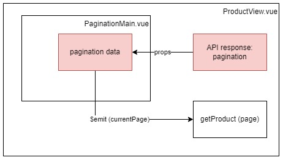

## Architectural Diagram

;

## Files related

- components/
  - PaginationMain.vue

## Steps

1. Create PaginationMain component
2. Pass api response data: pagination to the component via props for showing page numbers
3. Pass the current page data to getProduct function for fetching the product list

## Q&A

1. What's the differences between Object and Proxy Object?
   => It's ok to treat it as a normal object. More detailed: https://developer.mozilla.org/en-US/docs/Web/JavaScript/Reference/Global_Objects/Proxy
