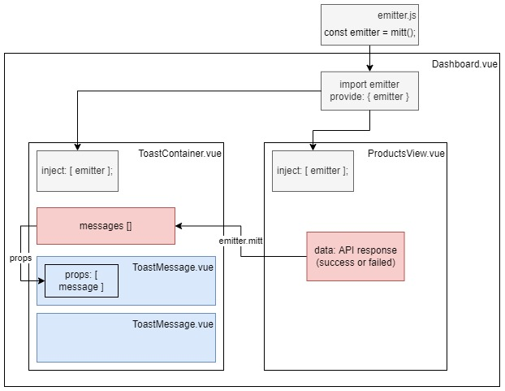

## Architectural Diagram

;

## File related

- components/
  - ToastContainer.vue
  - ToastMessage.vue
- methods/
  - emitter.js

## Steps

1. Import emitter to Dashboard.vue
2. Create 2 components: ToastContainer.vue & ToastMessage.vue
3. Import ToastMessage.vue to ToastContainer.vue as component contents
4. ProductsView.vue send API response results to ToastContainer.vue via emitter
5. ToastContainer.vue send messages to ToastMessage.vue via props

## Q&A

1. Should emitter.js be registered after importing to Dashboard.vue?
   => Not required. It can also be used for provide/inject after importing for the Airbnb syntax check.
2. When should(n't) I use $ sign for emit?
   - For mitt.js (emitter) => emitter.emit('event name', code);
   - For Vue native emit => this.$emit('event name', code);
